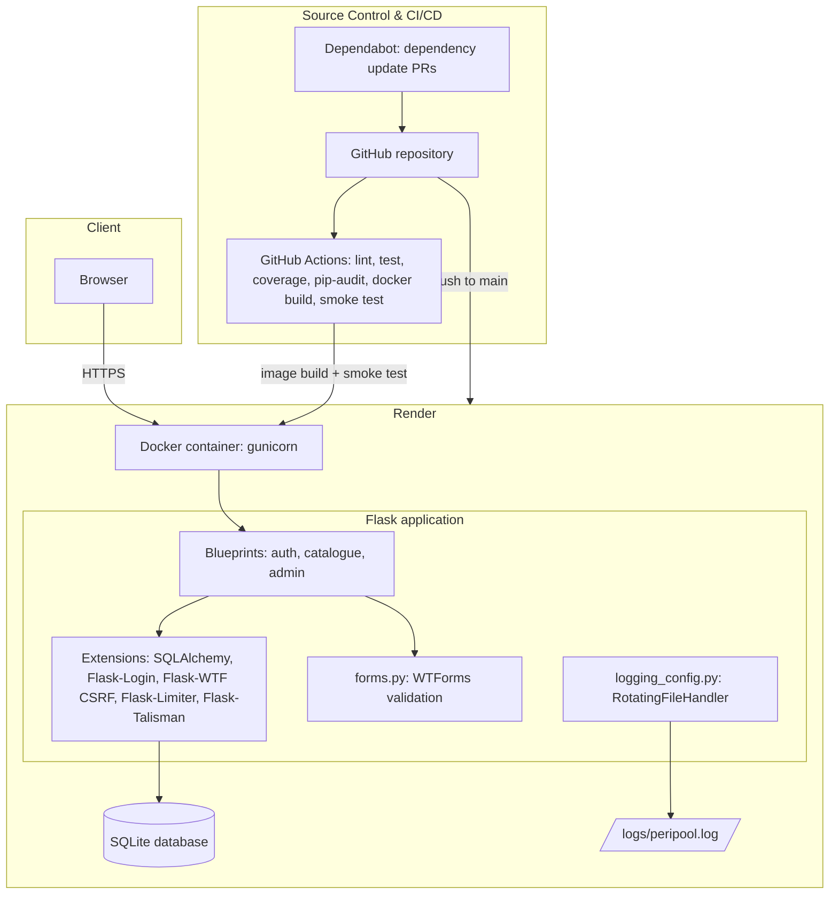
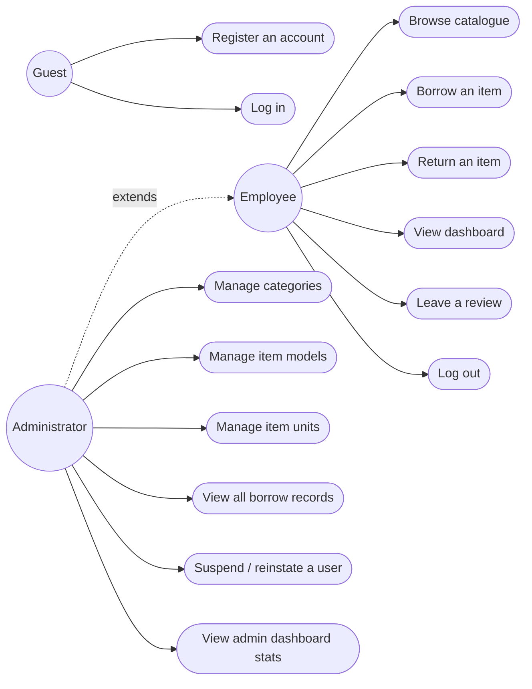

# PeriPool Architecture & Use Cases

## 1. System architecture

The application is a monolithic Flask app, containerised with Docker and deployed
to Render. Source control, CI, and deployment are connected so that a push to
`main` is linted, tested, built into an image, smoke-tested, and (on Render)
redeployed automatically.



Notes for the report:

- **Monolith, not microservices** — a deliberate choice for an application this
  size. Splitting into services would add network calls and deployment
  complexity without a corresponding benefit at this scale; modularisation is
  instead achieved inside the monolith via blueprints (see
  [Folder structure](#2-folder-structure--modularisation) below).
- **SQLite on Render's free tier has no persistent disk** — the container's
  filesystem is rebuilt on every deploy, so `entrypoint.sh` reseeds the
  database automatically if it finds no users. This is a reasonable trade-off
  for a teaching demo, and is the basis for the "future improvement" section
  discussed in [postgres_migration.md](postgres_migration.md).

## 2. Folder structure & modularisation

```
peripool/
├── app/
│   ├── __init__.py          # application factory: builds and wires up the app
│   ├── blueprints/
│   │   ├── auth.py          # register, login, logout
│   │   ├── catalogue.py     # browse, borrow, return, dashboard, reviews
│   │   └── admin.py         # admin-only CRUD and reporting
│   ├── models.py            # SQLAlchemy models
│   ├── forms.py             # WTForms validation, one class per form
│   ├── decorators.py        # admin_required
│   ├── errors.py            # 403/404/429/CSRF error handlers
│   ├── logging_config.py    # structured logging setup
│   ├── extensions.py        # single shared instances of db, login_manager, csrf, limiter, talisman
│   ├── static/               # CSS and JS, no external CDN dependency
│   └── templates/            # Jinja2 templates, incl. macros.html for shared form rendering
├── config.py                 # environment-driven configuration classes
├── scripts/reseed_database.py
├── tests/                    # pytest, one file per feature area
├── docs/                     # design and architecture documentation
├── Dockerfile, docker-compose.yml, entrypoint.sh
└── .github/workflows/ci.yml
```

**Why this structure, and how it helps:**

- **Blueprints split by user-facing concern** (`auth`, `catalogue`, `admin`)
  rather than by technical layer. Each blueprint is independently readable —
  understanding "what can an admin do" means reading one 260-line file, not
  hunting through a single monolithic routes file. This also scales cleanly:
  a new feature area (e.g. a `reports` blueprint) can be added without
  touching existing blueprints.
- **`forms.py` centralises validation.** Every field's rules live in exactly
  one place, so a rule change (e.g. the password policy) only needs editing
  once, and every route that uses that form gets the update automatically —
  see [Section 3](#3-refactoring-evidence-forms--duplication) below for a
  concrete before/after.
- **`extensions.py` avoids circular imports** by creating each Flask
  extension instance once, then having `create_app()` call `.init_app(app)`
  on each — the standard Flask application-factory pattern, which is also
  what makes the app trivially testable (a fresh app per test, see
  `tests/conftest.py`).
- **`config.py` is environment-driven, not hardcoded**, so the same codebase
  runs correctly in development, automated tests, and production (Render)
  by changing one environment variable (`FLASK_CONFIG`) — see
  [Section 4](#4-configuration-evidence) for the actual file.

## 3. Refactoring evidence: forms & duplication

Before `forms.py` existed, every admin create/edit route manually pulled
fields off `request.form`, validated them by hand, and flashed errors —
repeated almost identically for categories, item models, and item units.
After the refactor, each entity gets one WTForms class and one route that
handles both create and edit:

```python
# app/blueprints/admin.py
@admin.route('/categories/new', methods=['GET', 'POST'])
@admin.route('/categories/<int:category_id>/edit', methods=['GET', 'POST'])
@admin_required
def category_form(category_id=None):
    """Create a new category, or edit an existing one."""
    category = db.get_or_404(Category, category_id) if category_id else None
    form = CategoryForm(obj=category, category_id=category_id)

    if form.validate_on_submit():
        if category is None:
            category = Category()
            db.session.add(category)

        form.populate_obj(category)
        db.session.commit()
        ...
```

The same shape (two routes decorating one function, `obj=` pre-fills the
form on edit, `populate_obj` writes validated data back) is reused for
`item_model_form` and `item_unit_form` — three entities, one pattern, no
copy-pasted validation logic.

## 4. Configuration evidence

`config.py` defines one class per environment, selected by the
`FLASK_CONFIG` environment variable, so nothing environment-specific is
hardcoded in application code:

```python
class ProductionConfig(Config):
    """Configuration for a deployed environment."""

    DEBUG = False
    SECRET_KEY = os.environ.get('SECRET_KEY')

    SESSION_COOKIE_SECURE = True
    FORCE_HTTPS = True
```

`get_config()` fails fast — raising `RuntimeError` — if production is
selected without a `SECRET_KEY` in the environment, rather than silently
falling back to an insecure default.

## 5. Use case diagram



An Administrator is a superset of Employee — every admin account can also
browse, borrow, and review like a regular employee (the `admin_required`
decorator only gates the admin-only routes; it does not remove access to
the ordinary catalogue/dashboard routes).
