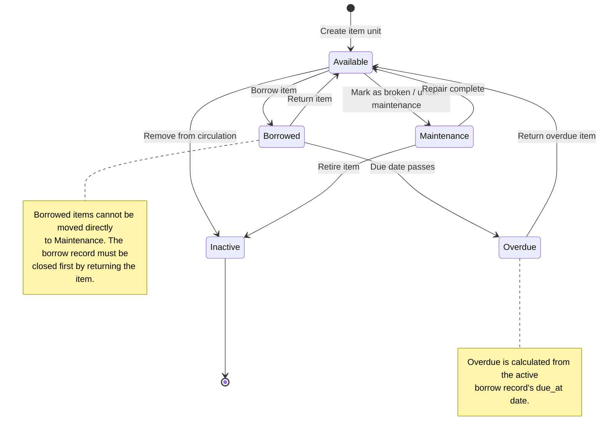
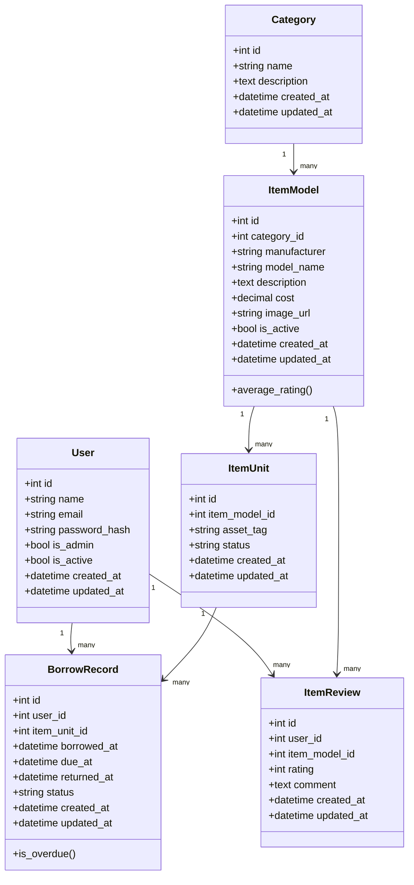
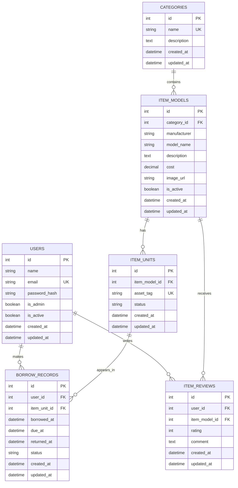

# PeriPool Database Design

## 1. Design overview

## 2. State transition model

## 3. Conceptual data model

The system is based on six main business entities:

- User: a person who can log in and borrow items.
- Category: a grouping such as Headsets, Mice, Keyboards, or Webcams.
- Item Model: a type of item, such as "Dell Wireless Mouse".
- Item Unit: an individual physical item that can be borrowed.
- Borrow Record: a record of a user borrowing a specific item unit.
- Item Review: feedback left by a user for an item model.

Main relationships:

- One user can have many borrow records.
- One category can contain many item models.
- One item model can have many physical item units.
- One item unit can appear in many borrow records over its lifetime.
- One user can write many reviews.
- One item model can receive many reviews.

## 4. Logical data model

### User
- id: Primary Key
- name
- email: Unique
- password_hash
- is_admin
- is_active
- created_at
- updated_at

### Category
- id: Primary Key
- name: Unique
- description
- created_at
- updated_at

### ItemModel
- id: Primary Key
- category_id: Foreign Key to Category
- manufacturer
- model_name
- description
- cost
- image_url
- is_active
- created_at
- updated_at

Constraint:
- manufacturer and model_name must be unique together.

### ItemUnit
- id: Primary Key
- item_model_id: Foreign Key to ItemModel
- asset_tag: Unique
- status
- created_at
- updated_at

### BorrowRecord
- id: Primary Key
- user_id: Foreign Key to User
- item_unit_id: Foreign Key to ItemUnit
- borrowed_at
- due_at
- returned_at
- status
- created_at
- updated_at

### ItemReview
- id: Primary Key
- user_id: Foreign Key to User
- item_model_id: Foreign Key to ItemModel
- rating
- comment
- created_at
- updated_at

Constraint:
- A user can only review each item model once.

## 5. Physical data model / database schema

### Table: users

| Column | Type | Constraint |
|---|---|---|
| id | Integer | Primary Key |
| name | String(100) | Not Null |
| email | String(150) | Unique, Not Null, Indexed |
| password_hash | String(255) | Not Null |
| is_admin | Boolean | Default False, Not Null |
| is_active | Boolean | Default True, Not Null |
| created_at | DateTime | Default Current Timestamp, Not Null |
| updated_at | DateTime | Default Current Timestamp, Not Null |

### Table: categories

| Column | Type | Constraint |
|---|---|---|
| id | Integer | Primary Key |
| name | String(100) | Unique, Not Null |
| description | Text | Nullable |
| created_at | DateTime | Default Current Timestamp, Not Null |
| updated_at | DateTime | Default Current Timestamp, Not Null |

### Table: item_models

| Column | Type | Constraint |
|---|---|---|
| id | Integer | Primary Key |
| category_id | Integer | Foreign Key to categories.id, Not Null |
| manufacturer | String(100) | Not Null |
| model_name | String(150) | Not Null |
| description | Text | Nullable |
| cost | Numeric(10,2) | Nullable |
| image_url | String(500) | Nullable |
| is_active | Boolean | Default True, Not Null |
| created_at | DateTime | Default Current Timestamp, Not Null |
| updated_at | DateTime | Default Current Timestamp, Not Null |

Unique constraint:
- manufacturer + model_name

### Table: item_units

| Column | Type | Constraint |
|---|---|---|
| id | Integer | Primary Key |
| item_model_id | Integer | Foreign Key to item_models.id, Not Null |
| asset_tag | String(100) | Unique, Not Null |
| status | String(30) | Default 'available', Not Null |
| created_at | DateTime | Default Current Timestamp, Not Null |
| updated_at | DateTime | Default Current Timestamp, Not Null |

Allowed status values:
- available
- borrowed
- maintenance
- inactive

### Table: borrow_records

| Column | Type | Constraint |
|---|---|---|
| id | Integer | Primary Key |
| user_id | Integer | Foreign Key to users.id, Not Null |
| item_unit_id | Integer | Foreign Key to item_units.id, Not Null |
| borrowed_at | DateTime | Default Current Timestamp, Not Null |
| due_at | DateTime | Not Null |
| returned_at | DateTime | Nullable |
| status | String(30) | Default 'active', Not Null |
| created_at | DateTime | Default Current Timestamp, Not Null |
| updated_at | DateTime | Default Current Timestamp, Not Null |

Allowed status values:
- active
- returned
- cancelled

Overdue records are identified where:
- status = active
- returned_at is null
- due_at is before the current date/time

### Table: item_reviews

| Column | Type | Constraint |
|---|---|---|
| id | Integer | Primary Key |
| user_id | Integer | Foreign Key to users.id, Not Null |
| item_model_id | Integer | Foreign Key to item_models.id, Not Null |
| rating | Integer | Not Null |
| comment | Text | Nullable |
| created_at | DateTime | Default Current Timestamp, Not Null |
| updated_at | DateTime | Default Current Timestamp, Not Null |

Constraints:
- user_id + item_model_id must be unique.
- rating should be between 1 and 5.

## 6. UML class diagram

## 7. Entity-relationship diagram

## 8. Design rules and constraints

### User deletion
Users should not normally be deleted because this could damage historical borrowing records. Instead, a user can be marked as inactive by setting `is_active` to false.

### Item availability
Available stock is not stored directly on `item_models`. It is calculated by counting related `item_units` where `status = 'available'`.

### Borrowing rule
An item unit can only be borrowed if its status is `available`.

When an item is borrowed:
- `item_units.status` changes to `borrowed`
- a new `borrow_records` row is created
- `borrow_records.status` is set to `active`
- `borrow_records.returned_at` remains null

When an item is returned:
- `borrow_records.status` changes to `returned`
- `borrow_records.returned_at` is set to the current timestamp
- `item_units.status` changes back to `available`

### Overdue rule
Overdue status is calculated rather than permanently stored on the item unit.

A borrow record is overdue when:
- `borrow_records.status = 'active'`
- `borrow_records.returned_at is null`
- `borrow_records.due_at` is before the current datetime

### Review rule
A user can only review each item model once. This is enforced using a unique constraint on:
- `user_id`
- `item_model_id`

### Rating rule
Review ratings must be between 1 and 5. Average item ratings are calculated from related item review records.