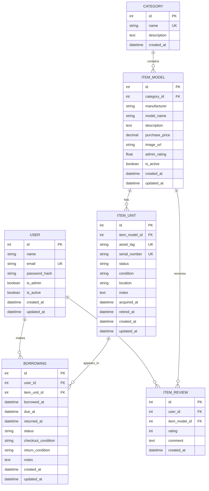

# PeriPool Database Schema

# Press ctrl + shift + v to view it

```mermaid
erDiagram
    USER ||--o{ BORROWING : makes
    USER ||--o{ ITEM_REVIEW : writes

    CATEGORY ||--o{ ITEM_MODEL : contains

    ITEM_MODEL ||--o{ ITEM_UNIT : has
    ITEM_MODEL ||--o{ ITEM_REVIEW : receives

    ITEM_UNIT ||--o{ BORROWING : appears_in

    USER {
        int id PK
        string name
        string email UK
        string password_hash
        boolean is_admin
        boolean is_active
        datetime created_at
        datetime updated_at
    }

    CATEGORY {
        int id PK
        string name UK
        text description
        datetime created_at
    }

    ITEM_MODEL {
        int id PK
        int category_id FK
        string manufacturer
        string model_name
        text description
        decimal purchase_price
        string image_url
        float admin_rating
        boolean is_active
        datetime created_at
        datetime updated_at
    }

    ITEM_UNIT {
        int id PK
        int item_model_id FK
        string asset_tag UK
        string serial_number UK
        string status
        string condition
        string location
        text notes
        datetime acquired_at
        datetime retired_at
        datetime created_at
        datetime updated_at
    }

    BORROWING {
        int id PK
        int user_id FK
        int item_unit_id FK
        datetime borrowed_at
        datetime due_at
        datetime returned_at
        string status
        string checkout_condition
        string return_condition
        text notes
        datetime created_at
        datetime updated_at
    }

    ITEM_REVIEW {
        int id PK
        int user_id FK
        int item_model_id FK
        int rating
        text comment
        datetime created_at
    }
```