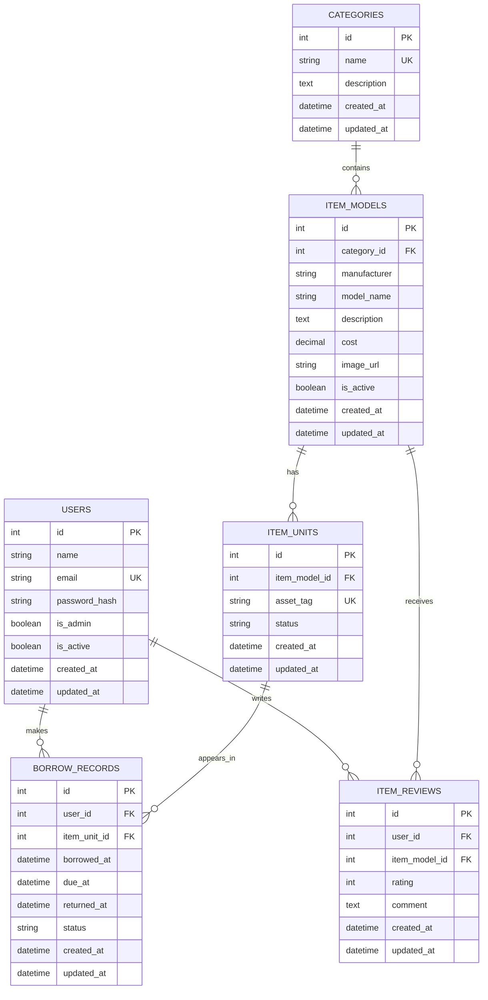

# PeriPool Database Schema

This entity-relationship diagram matches the current SQLAlchemy models and the
schema described in `docs/database_design.md`.

```mermaid
erDiagram
    USERS ||--o{ BORROW_RECORDS : makes
    USERS ||--o{ ITEM_REVIEWS : writes

    CATEGORIES ||--o{ ITEM_MODELS : contains

    ITEM_MODELS ||--o{ ITEM_UNITS : has
    ITEM_MODELS ||--o{ ITEM_REVIEWS : receives

    ITEM_UNITS ||--o{ BORROW_RECORDS : appears_in

    USERS {
        int id PK
        string name
        string email UK
        string password_hash
        boolean is_admin
        boolean is_active
        datetime created_at
        datetime updated_at
    }

    CATEGORIES {
        int id PK
        string name UK
        text description
        datetime created_at
        datetime updated_at
    }

    ITEM_MODELS {
        int id PK
        int category_id FK
        string manufacturer
        string model_name
        text description
        decimal cost
        string image_url
        boolean is_active
        datetime created_at
        datetime updated_at
    }

    ITEM_UNITS {
        int id PK
        int item_model_id FK
        string asset_tag UK
        string status
        datetime created_at
        datetime updated_at
    }

    BORROW_RECORDS {
        int id PK
        int user_id FK
        int item_unit_id FK
        datetime borrowed_at
        datetime due_at
        datetime returned_at
        string status
        datetime created_at
        datetime updated_at
    }

    ITEM_REVIEWS {
        int id PK
        int user_id FK
        int item_model_id FK
        int rating
        text comment
        datetime created_at
        datetime updated_at
    }
```
